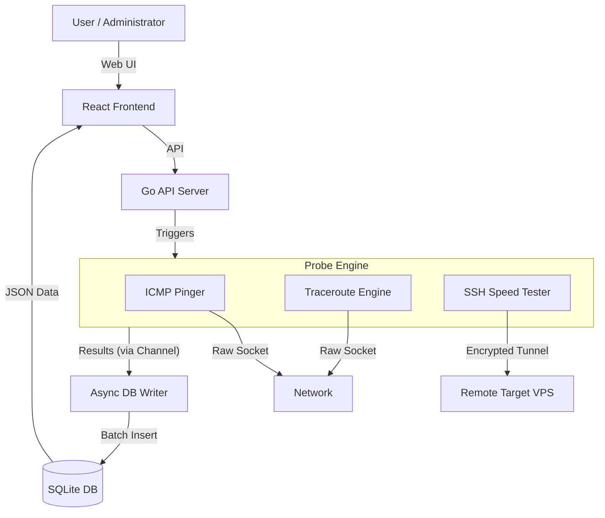

# RouteLens

[](https://goreportcard.com/report/github.com/yuanweize/RouteLens)
[](https://github.com/yuanweize/RouteLens/actions)
[](https://opensource.org/licenses/MIT)

[🇨🇳 中文文档](README_CN.md)

**RouteLens** is a modern network observability platform built with **Go** and **React**. It acts like an "X-ray" for your internet connection, allowing you to visualize the entire path from your local ISP to your remote VPS.

Unlike simple speed tests, RouteLens helps you answer: *"Is my connection slow because of my local ISP, the international backbone (CN2/9929), or the target datacenter?"*

## 🌟 Key Features

*   **🔍 Field-Tested MTR Tracing**: Visualize packet paths hop-by-hop using Native Go ICMP logic.
        *   *No external dependencies:* Uses raw sockets directly, avoiding `os/exec("mtr")`.
*   **🌍 GeoIP Visualization**: Map IP addresses to physical locations (City/Country/ISP) using MaxMind GeoLite2.
*   **🛡️ Stealth Mode (Speed Test)**: High-frequency monitoring using **SSH side-channels** without triggering ISP traffic shaping or GFW detection.
        *   **Zero Install**: No agent required on the target server.
        *   **Stealthy**: Looks like standard SSH traffic.
*   **� Modern Web Dashboard**: Built with **React** + **Arco Design** + **Apache ECharts** for beautiful, professional-grade visualization.
*   **� High-Performance Storage**: Built-in SQLite + WAL mode.

## 🛠️ Architecture



## 🚀 Deployment Strategy

RouteLens is designed to monitor **YOUR** local network quality. Therefore, the deployment strategy depends on what you want to monitor.

| Platform | Recommended? | Analysis |
| :--- | :--- | :--- |
| **Local Device** (Mac/Linux/Pi) | ✅ **Best** | Monitors the *actual* connection from your home/office to the target. Supports full MTR/Ping via Raw Sockets. |
| **Docker (Local)** | ✅ **Good** | Easy to manage. Requires `sysctls` or `cap_add` for Ping capabilities. |
| **Render / Railway / Fly.io** | ⚠️ **Conditional** | Monitors the *cloud provider's* network, NOT your home network. Useful for "Reverse Monitoring" (checking how your home IP looks from overseas). |
| **Vercel / Netlify** | ❌ **No** | These are Static/Serverless platforms. RouteLens requires a persistent background daemon for monitoring. |

### Option 1: Systemd (Recommended for Debian/Ubuntu)

```bash
git clone https://github.com/yuanweize/RouteLens.git
cd RouteLens
chmod +x scripts/install.sh
./scripts/install.sh
```

### Option 2: Docker

```bash
docker build -t routelens .
docker run -d \
  --name routelens \
  --cap-add=NET_RAW \
  -p 8080:8080 \
  -v $(pwd)/data:/data \
  -e RS_TARGETS="8.8.8.8,1.1.1.1" \
  routelens
```

## ⚙️ Configuration

| Variable | Description | Default |
| :--- | :--- | :--- |
| `RS_HTTP_PORT` | HTTP port | `8080` |
| `RS_DB_PATH` | Database path | `/data/routelens.db` |
| `RS_SSH_USER` | SSH User for speed test | `root` |
| `RS_SPEED_WINDOW` | Allowed window for speed tests (e.g. `02:00-08:00`) | *(All Day)* |

## License

MIT
