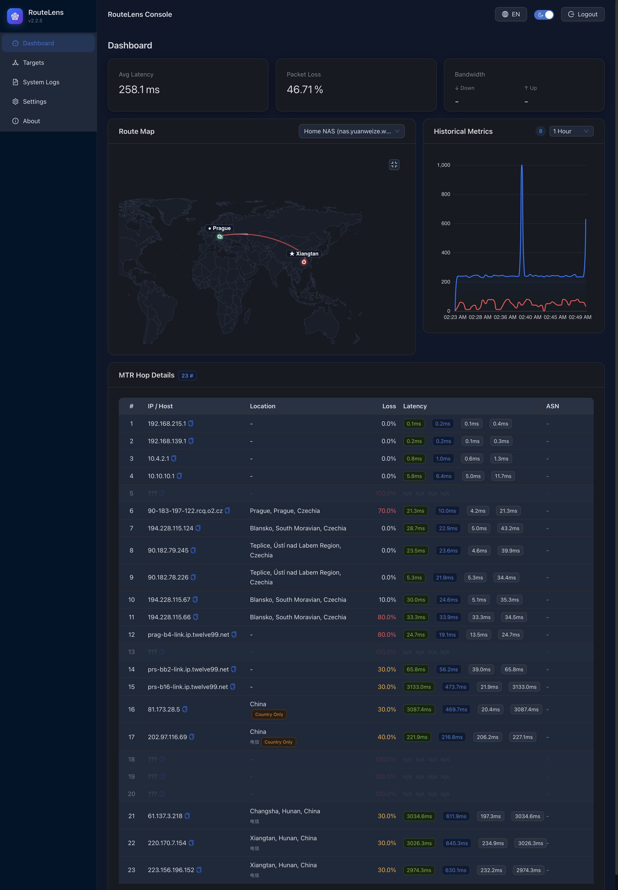
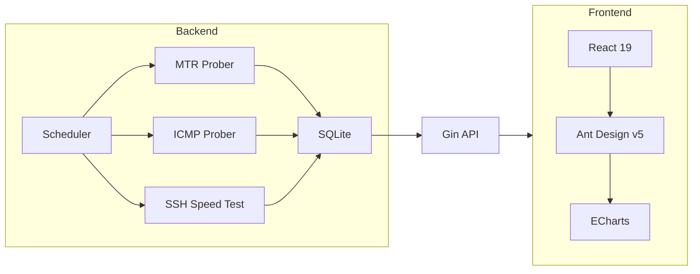

<div align="center">

```
██████╗  ██████╗ ██╗   ██╗████████╗███████╗██╗     ███████╗███╗   ██╗███████╗
██╔══██╗██╔═══██╗██║   ██║╚══██╔══╝██╔════╝██║     ██╔════╝████╗  ██║██╔════╝
██████╔╝██║   ██║██║   ██║   ██║   █████╗  ██║     █████╗  ██╔██╗ ██║███████╗
██╔══██╗██║   ██║██║   ██║   ██║   ██╔══╝  ██║     ██╔══╝  ██║╚██╗██║╚════██║
██████╔╝╚██████╔╝╚██████╔╝   ██║   ███████╗███████╗███████╗██║ ╚████║███████║
╚═════╝  ╚═════╝  ╚═════╝    ╚═╝   ╚══════╝╚══════╝╚══════╝╚═╝  ╚═══╝╚══════╝
```

**Modern, Agentless Network Observability Platform**

*Trace routes • Measure latency • Visualize paths — all from a single binary*

[](https://goreportcard.com/report/github.com/yuanweize/RouteLens)
[](https://opensource.org/licenses/MIT)
[](https://github.com/yuanweize/RouteLens/releases/latest)
[](https://github.com/yuanweize/RouteLens/actions)
[](https://github.com/yuanweize/RouteLens/pkgs/container/routelens)

[🇨🇳 中文文档](README_CN.md)

<br>


</div>

---

## Features

| Feature | Description |
|---------|-------------|
| **Agentless Monitoring** | High-precision ICMP ping, full MTR traceroute, and SSH-based bandwidth probing — zero target agents needed |
| **Spatial Clustering Map** | Intelligent Geo-clustering for transit hops, anti-collision labels, dark glassmorphism styling, and dynamic pulse arcs |
| **Full MTR Hop Observability** | Complete breakdown of every hop: IP/hostname, geo location, ISP/carrier, ASN, packet loss, and latency quartiles (Last/Avg/Best/Worst) |
| **Secure by Design** | Strict JWT authentication, brute-force rate limiter (5/min), in-memory SSH keys, original password verification, and command injection guards |
| **Precision GeoIP Dual-Engine**| MaxMind GeoLite2 City + ip2region for sub-city accuracy across 3,000+ cities with mirror fallback |
| **Historical Metrics & Telemetry**| Time-series charts for latency, loss rate, and bandwidth trends with synchronized auto-refresh |
| **Single Binary Delivery** | Embedded SPA assets, pure Go SQLite driver, zero runtime CGO dependencies, systemd ready |
| **In-App Self Upgrade** | One-click binary hot upgrade from GitHub Releases (AdGuard Home style) |
| **Dual Language Ready** | Seamless English and Chinese UI localization with native city and province translations |

---

## Documentation & Technical Guides

- 📘 **[Documentation Center](docs/index.md)**
- 🌐 **[Monitoring Packet Loss & Jitter Between VPS Servers](docs/guides/monitor-vps-packet-loss.md)**
- 🔍 **[Diagnosing Multi-Hop Network Latency and Route Flapping](docs/guides/diagnose-network-latency-multi-hop.md)**
- 🛡️ **[Agentless Remote Network Monitoring via Secure Telemetry](docs/guides/agentless-remote-network-monitoring.md)**

---

## Quick Start

### Option 1: Docker (Recommended)

```bash
docker run -d \
  --name routelens \
  --cap-add NET_RAW \
  --cap-add NET_ADMIN \
  -p 8080:8080 \
  -v $(pwd)/data:/data \
  -e RS_JWT_SECRET=your_secure_secret_here \
  ghcr.io/yuanweize/routelens:latest
```

### Option 2: Docker Compose

**Prerequisites:**
- Docker & Docker Compose installed

```bash
# 1. Download configuration
curl -O https://raw.githubusercontent.com/yuanweize/RouteLens/master/compose.yml

# 2. (Optional) Edit compose.yml to set environment variables like JWT secret

# 3. Start service
docker compose up -d

# 4. Visit http://localhost:8080
```

### Option 3: Binary

**Prerequisites:**
- **Linux/macOS**: Requires `mtr` (for route tracing) and `ping`.
  - Ubuntu/Debian: `sudo apt install mtr`
  - CentOS/RHEL: `sudo yum install mtr`
  - macOS: `brew install mtr` (requires running with sudo)
- **Windows**:
  - Requires `mtr` binary in system PATH (e.g. from WinMTR or similar, though Windows support is experimental).
  - Must run terminal as **Administrator**.
  - *Recommendation: Use WSL or Docker on Windows.*

Download from [Releases](https://github.com/yuanweize/RouteLens/releases/latest):

```bash
# Linux
VERSION=$(curl -s https://api.github.com/repos/yuanweize/RouteLens/releases/latest | grep tag_name | cut -d'"' -f4 | tr -d 'v')
curl -LO "https://github.com/yuanweize/RouteLens/releases/latest/download/routelens_${VERSION}_linux_amd64.tar.gz"
tar xzf routelens_${VERSION}_linux_amd64.tar.gz
chmod +x routelens

# Run directly
./routelens --port 8080

# Or install as systemd service
./routelens service install --port 8080
```

---

## Initial Setup

1. Open `http://your-server:8080`
2. You'll be redirected to `/setup` on first run
3. Create your admin account
4. Add monitoring targets in the dashboard
5. GeoIP database downloads automatically on first probe

---

## Configuration

### Environment Variables

| Variable | Description | Default |
|----------|-------------|---------|
| `RS_JWT_SECRET` | **⚠️ Required for production** - JWT signing key | Random (changes on restart) |
| `RS_HTTP_PORT` | HTTP listen address | `:8080` |
| `RS_DB_PATH` | SQLite database path | `./data/routelens.db` |
| `RS_GEOIP_PATH` | GeoIP database directory | `./data/geoip` |
| `RS_PROBE_INTERVAL` | Probe interval in seconds | `30` |
| `RS_LOG_LEVEL` | Log level (debug/info/warn/error) | `info` |

> ⚠️ **Security Note:** In production, always set `RS_JWT_SECRET` to a strong, random value. If not set, a random secret is generated at startup and all sessions will be invalidated on restart.

### Example `.env` file

```env
RS_JWT_SECRET=your-super-secure-random-string-at-least-32-chars
RS_HTTP_PORT=:8080
RS_PROBE_INTERVAL=60
```

---

## In-App Updates

RouteLens supports seamless self-updates directly from the web UI:

1. Go to **Settings** → **About & Updates**
2. Click **Check for Updates**
3. If available, click **Install Update**
4. Service restarts automatically with the new version

**Requirements:**
- Process must have write permission to its own binary
- For systemd: service will exit and systemd restarts it

---

## Architecture


```mermaid
flowchart LR
  subgraph Backend
    A[Scheduler] --> B[MTR Prober]
    A --> C[ICMP Prober]
    A --> D[SSH Speed Test]
    B & C & D --> E[SQLite]
  end
  
  subgraph Frontend
    F[React 19] --> G[Ant Design v5]
    G --> H[ECharts]
  end
  
  I[Gin API] --> Frontend
  E --> I
```

---

## Project Structure

```
.
├── cmd/server/       # Application entrypoint
├── internal/
│   ├── api/          # REST API handlers & middleware
│   ├── auth/         # JWT authentication
│   └── monitor/      # Probe scheduler
├── pkg/
│   ├── prober/       # MTR, ICMP, SSH speed test
│   ├── storage/      # SQLite repository
│   └── geoip/        # GeoIP enrichment
└── web/              # React frontend (Vite + TypeScript)
```

---

## Development

### Build from Source

```bash
# Clone repository
git clone https://github.com/yuanweize/RouteLens.git
cd RouteLens

# Build frontend
cd web && npm ci && npm run build && cd ..

# Build binary (uses Makefile)
make build          # Build for current platform
make build-linux    # Build for Linux amd64
make build-all      # Build for all platforms
```

### Version Management

Version is managed from a single source of truth: `.github/.release-please-manifest.json`

- **CI builds**: GoReleaser automatically injects version via ldflags
- **Local builds**: `make build` extracts version from manifest
- **Docker builds**: Dockerfile copies manifest for embedding

```bash
# Check current version
make version
```

---

## Security

RouteLens includes comprehensive security hardening:

- **JWT Authentication** with cryptographically random secrets
- **Login Rate Limiting** (5 attempts per IP per minute)
- **Input Sanitization** on all probe targets (prevents command injection)
- **Password Validation** (6-72 character limit, bcrypt hashing)
- **Username Validation** (3-32 alphanumeric characters)
- **Generic Error Messages** (internal errors hidden from users)
- **Thread-Safe Operations** (RWMutex protection on shared data)

---

## License

[MIT License](LICENSE) — Free for personal and commercial use.
